# burger-management-system
This Windows application is a comprehensive solution for managing and ordering burgers, developed as a course assignment for Bahçeşehir University Wissen Academy. The project utilizes EF8, Code First, and Windows Forms to provide a seamless and efficient experience for both customers and administrators.
=======
# Burger Management and Ordering System

## Overview

This Windows application is a comprehensive solution for managing and ordering burgers, developed as a course assignment for Bahçeşehir University Wissen Academy. The project utilizes EF8, Code First, and Windows Forms to provide a seamless and efficient experience for both customers and administrators.

## Features

### Customer Interface

- **Product Listing**: Browse through a list of available burgers and categories.
- **Shopping Cart**: Add desired products to the cart, select quantities, and proceed to checkout.
- **Order Placement**: Enter delivery address, review order details, and place orders.
- **User Settings**: Manage personal details and address information.

### Admin Interface

- **Category Management**: Create, update, and delete product categories.
- **Product Management**: Add, update, and remove products.
- **User Management**: View and manage user accounts.
- **Application Settings**: Configure various application settings.
- **Order Management**: Track and manage orders.
- **Statistics**: View and analyze sales and order statistics.

## Technologies Used

- **Entity Framework Core 8 (EF8)**
- **Code First Approach**
- **Windows Forms**
- **C#**
- **.NET Framework**

## Screenshots

### Login Interface
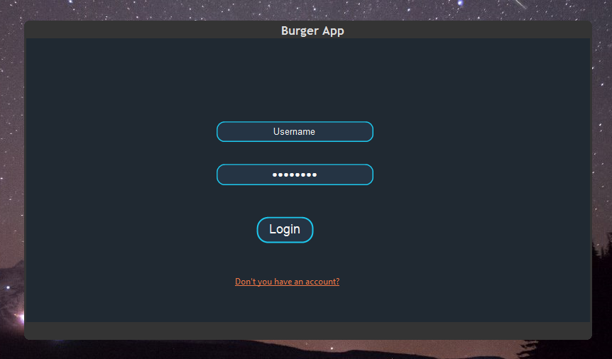

### Customer Interface
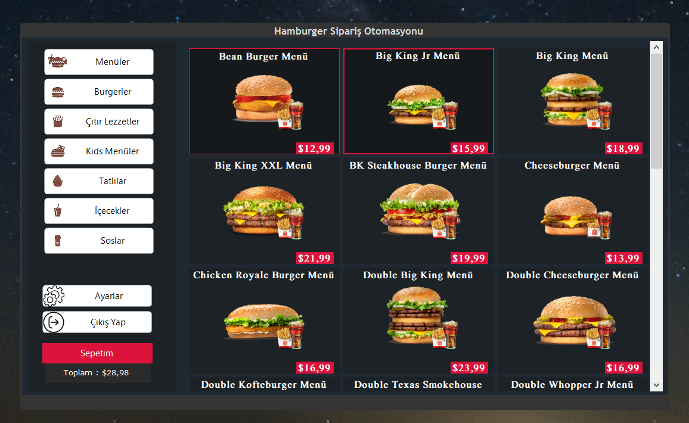

### Shopping Cart
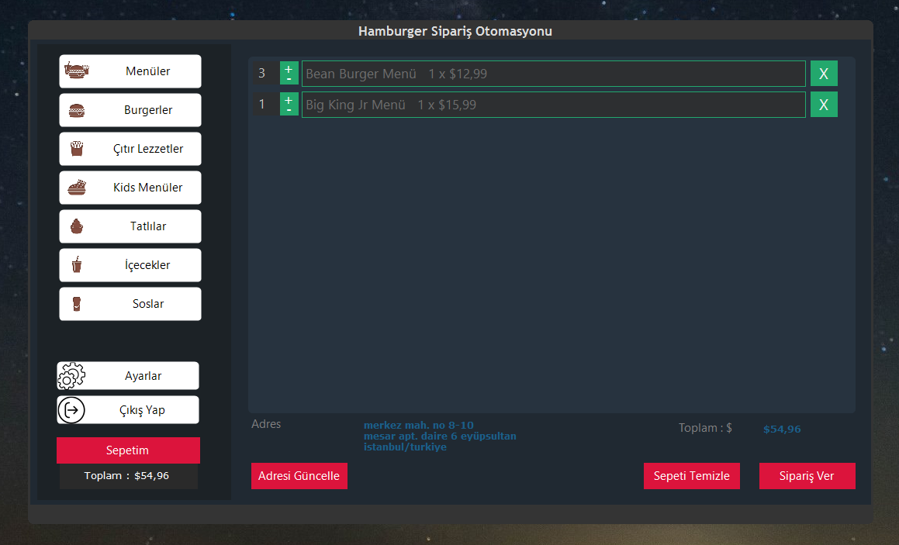

### Customer Adresses

### Customer Settings
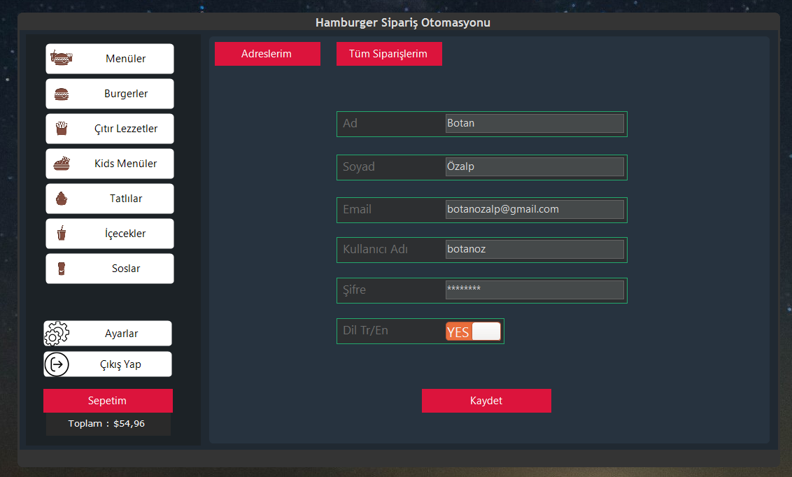

### All Order
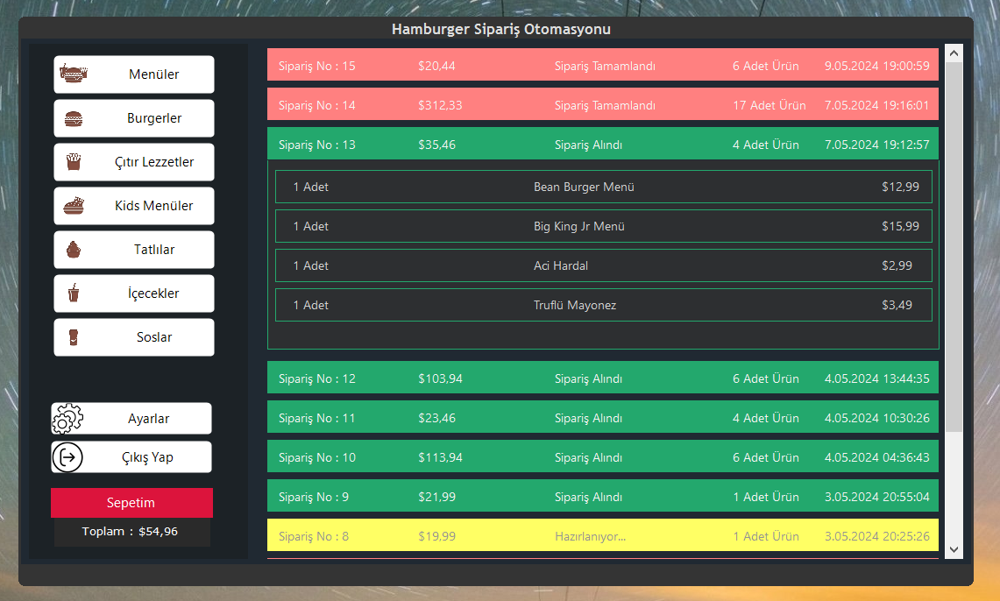

### Statistics
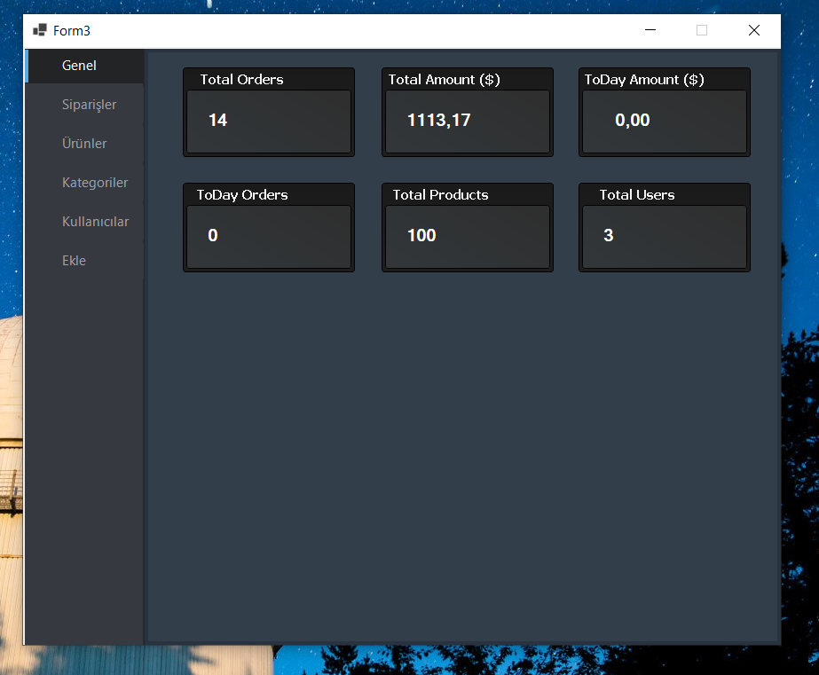

### Admin, Addition Screen
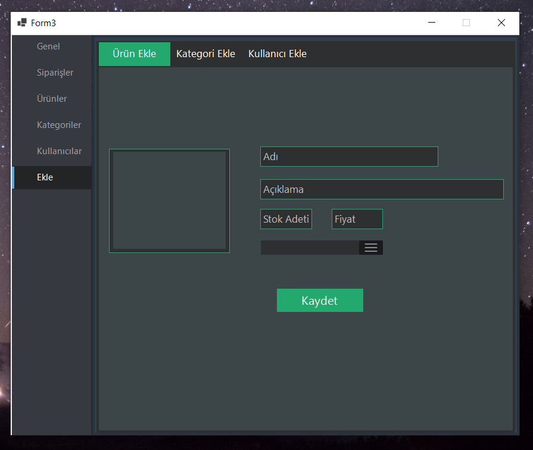

### Category Management
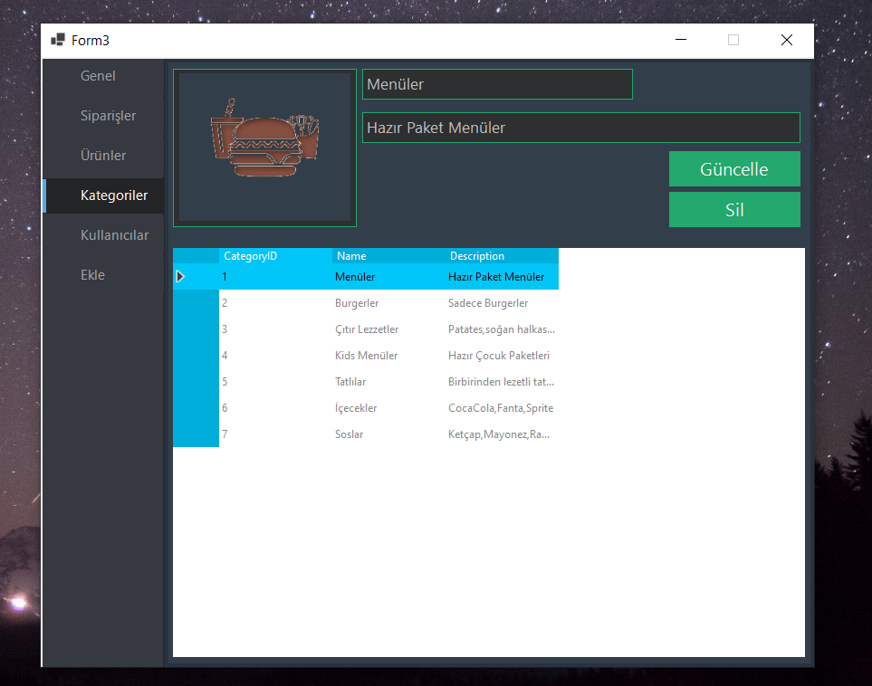

### Product Management
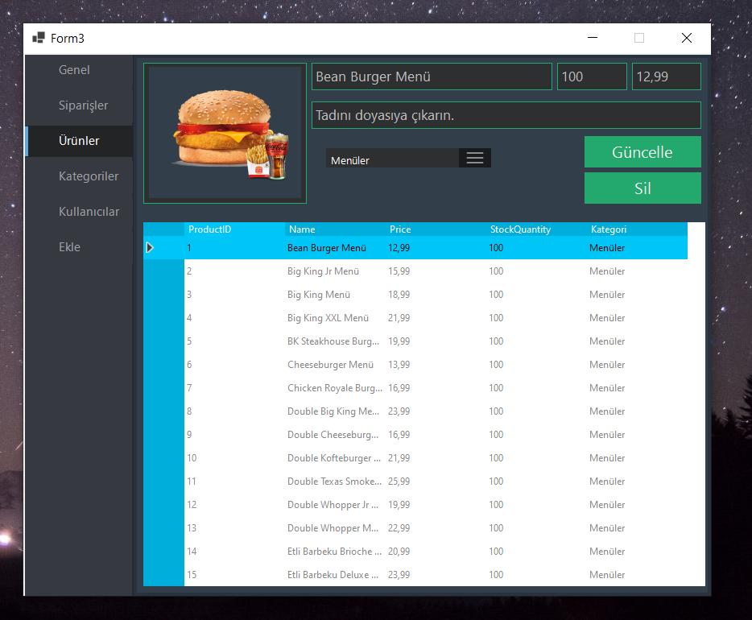

### User Management
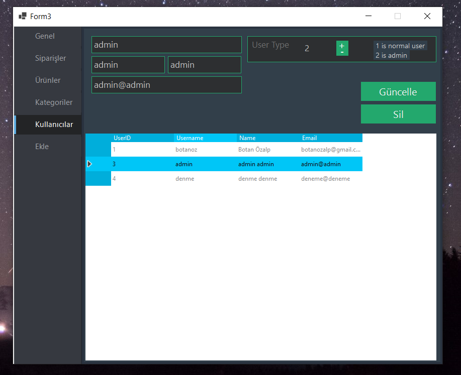

### Order Management
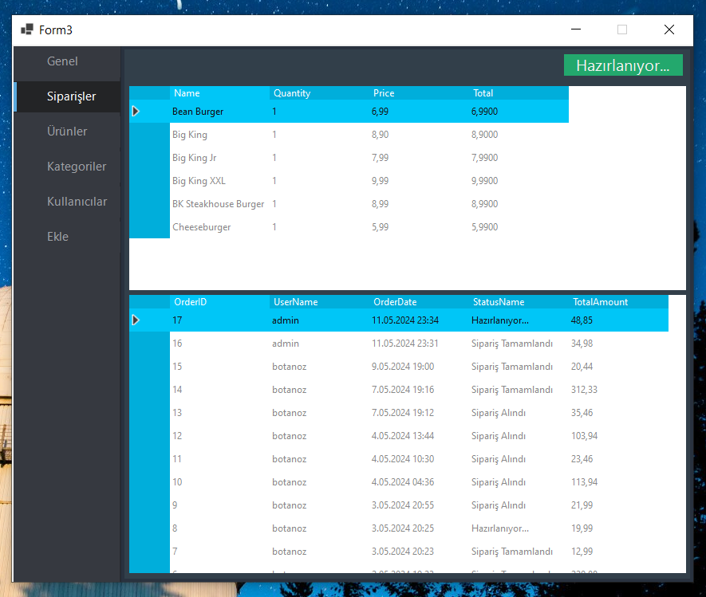

### Database
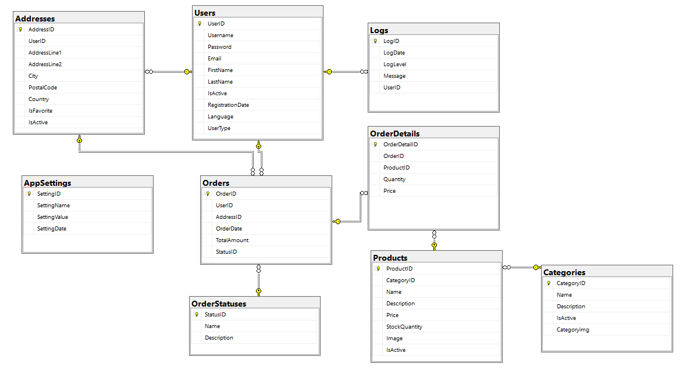

## Installation

1. Clone the repository: `git clone https://github.com/botanoz/burger-management-system.git`
2. Open the solution file in Visual Studio.
3. Restore the NuGet packages.
4. Execute the SQL script provided in the `Database` folder to set up the database.
5. Update the `appsettings.cs` file
6. Build and run the application.

## Usage

- **Customer Login**: Use the provided credentials to log in as a customer and start ordering burgers.
- **Admin Login**: Use the provided admin credentials to access the admin interface and manage the application.

## Contribution

Feel free to fork the repository and submit pull requests. For major changes, please open an issue to discuss what you would like to change.

## License

This project is licensed under the MIT License. See the [LICENSE](LICENSE) file for details.

## Acknowledgements

This project was developed as part of the course requirements for Bahçeşehir University Wissen Academy.
>>>>>>> 3bf7102 (Initial commit)
